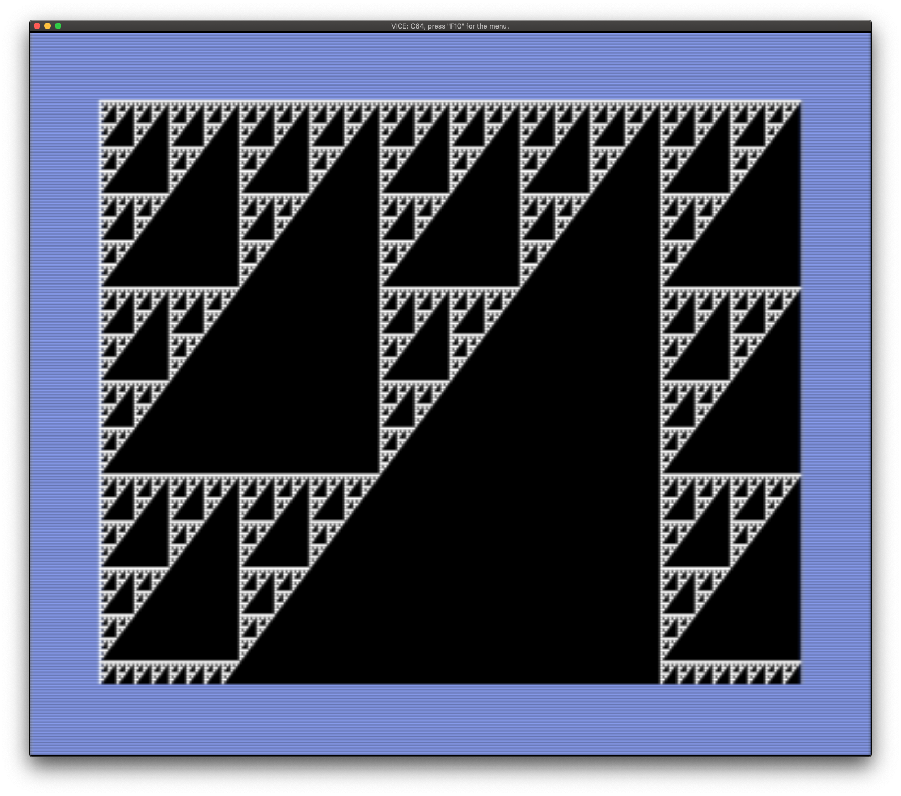

# sierpinski-c64

A simple approach to creating Sierpinski Triangles on the Commodore 64, written in C and cross-compiled to 6502 assembly using [cc65](https://cc65.github.io/).



## Running

Copy the [disk image](sierpinski.d64) file to a floppy disk or open it with your favorite emulator, such as [VICE](http://vice-emu.sourceforge.net/).

On the Commodore 64, type the following. (Note that an emulator such as VICE might do this for you automatically.)

```basic
LOAD"*",8,1
```

## Compiling

Install development tools appropriate for your platform, including GNU Make.

You'll need to install cc65 and VICE. On macOS using Homebrew:

```sh
brew install cc65 vice
```

Compile the code.

```shell
make
```
